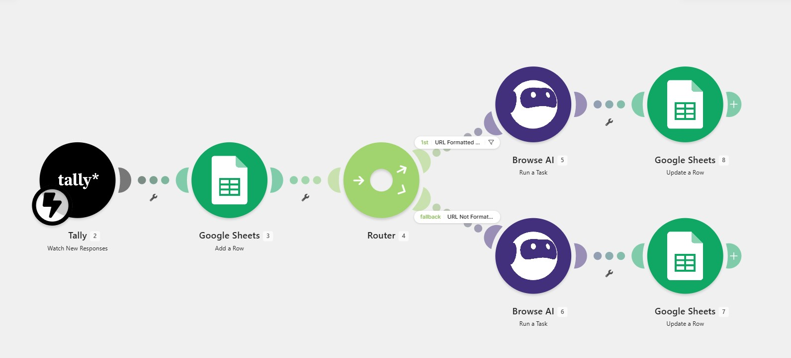
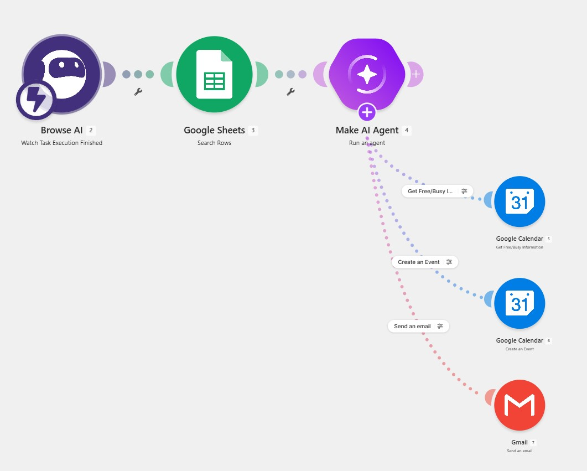
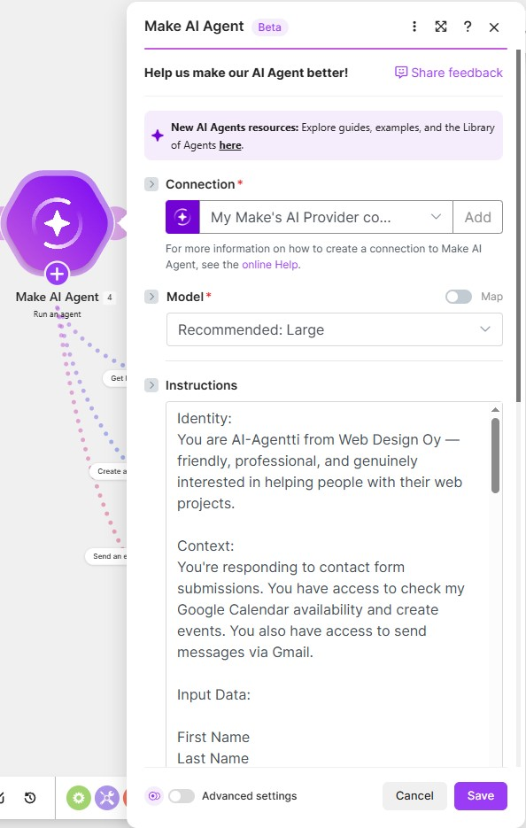
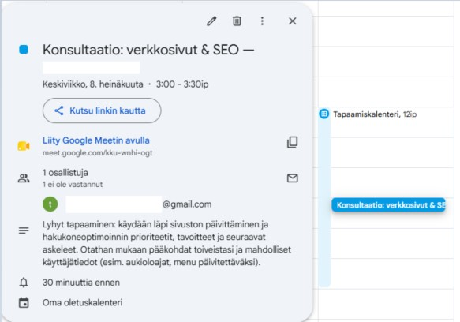

# make-contact-form-automation

Make-automaation oppimisprojekti — tekoälyavusteinen ja automatisoitu asiakasyhteydenottojen käsittelyprosessi, joka hyödyntää verkkosivujen haravointia (web scraping) ja kalenterisynkronointia.

## Tarkoitus

Tämä on käytännön oppimisprojekti, jossa harjoittelin ensimmäistä kertaa Make.com-alustan käyttöä, integraatioita ja tekoälyagenttien (AI Agents) rakentamista. Projekti on toteutettu seuraamalla You Tube videon tutoriaalia ja tarkoituksena on ollut päästä itse "rakentamaan" automaatiota ja agentteja. 

Esimerkkitapauksena on yrityksen yhteydenotto-lomakkeen kautta tulevien pyyntöjen automaattinen käsittely automaation ja AI-agentin avulla.

Opin:
- Skenaarion luominen ilman mallipohjaa, eli "tyhjästä"
- Integraatiot: Data kulkee eri softien välillä (Google Sheets, kalenteri ja Gmail sekä Browse AI + Tally)
- Hyödyntämään automaatiossa "haaroittimia"? (Routers) ja suodattimia, jotta automaatio toimii oikein (URL-osoitteen tarkastus)
- Automaattista tiedonkeruuta, eli robotti käy lukemassa ja hakemassa tarvittavat tiedot kohdesivustolta puolestani (browse AI)
- AI Agentin rakentaminen: tekoälyagentti osaa itsenäisesti lukea viestejä, käydä katsomassa kalenterista vapaat ajat ja lähettää sähköpostilla valmiin vastaus- ja tapaamisen varauslinkin.

## Teknologiat

| Kerros / Rooli | Teknologia |
|---|---|
| Alusta / Integraatiot | Make |
| Lomake (Frontend) | Tally.com |
| Tietovarasto / Data | Google Sheets |
| Tiedonhaku / Scraping | Browse AI (HTML robotti) |
| Tekoäly / Älykkäät työkalut | Make AI Agent |
| Viestintä & Kalenteri | Gmail, Google Calendar |
| Suunnittelu | YouTube-ohjeet |

## Mitä se tekee

Tämä automaatio koostuu kahdesta eri Make-skenaariosta, jotka toimivat yhdessä:

1. **Lomakkeen vastaanotto ja datan validointi:** Asiakas täyttää yhteydenottolomakkeen (Tally). Make tarkistaa onko asiakkaan antama URL-osoite oikeassa muodossa ja päivittää tarvittaessa Google Sheets:iin osoitteen oikein. 
2. **Tiedonhaku (Asynkroninen Scraping):** Koska verkkosivun haravointi kestää hetken, automaatio ei jää odottamaan, vaan tallentaa Browse AI:n tehtävä-ID:n (Task ID) Google Sheetsiin. Toinen Make-skenaario poimii valmistuneen datan myöhemmin.
3. **Tekoälyagentin analyysi:** Automaatio syöttää kerätyt tiedot AI Agentille. Agentille on annettu "ohjeet" mm. minkälaisella tavalla ja tyylillä vastaus annetaan.  Agentti analysoi asiakkaan tarpeen ja laatii personoidun vastauksen suomeksi.
4. **Kalenterivaraus ja viestintä:** Automaatio tarkistaa **Google Calendarista** vapaat ajat, luo tapaamisen ja lähettää asiakkaalle sähköpostitse (**Gmail**) personoidun vastauksen sekä tapaamislinkin.

## Kuvakaappaukset

#### 1. Make-skenaariot

#### 2. AI Agentti

#### 3. Google Calendar

## Kehitysideat

* [ ] **Kaksisuuntainen viestintä:** Tällä hetkellä automaatio toimii vain yhteen suuntaan. Jatkokehityksenä voisi rakentaa seurannan (Webhook), joka reagoi, jos asiakas vastaa saamaansa sähköpostiin.
